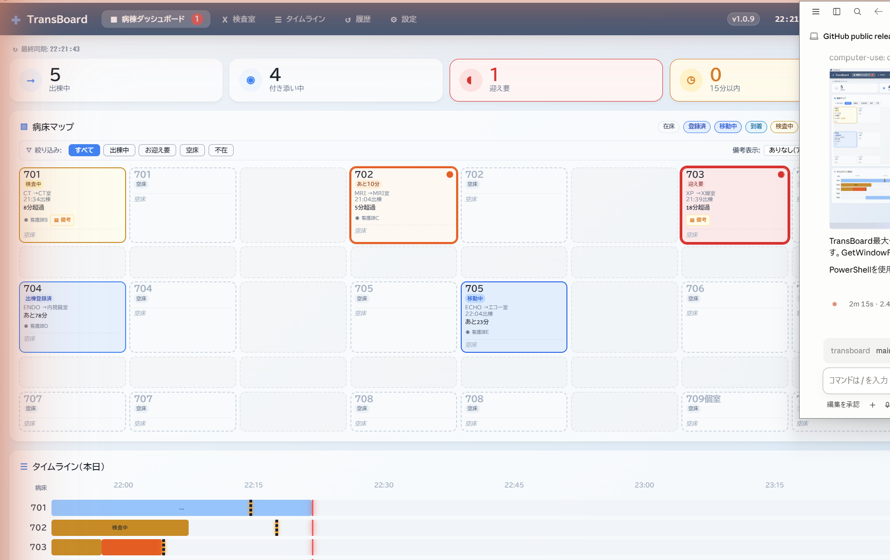
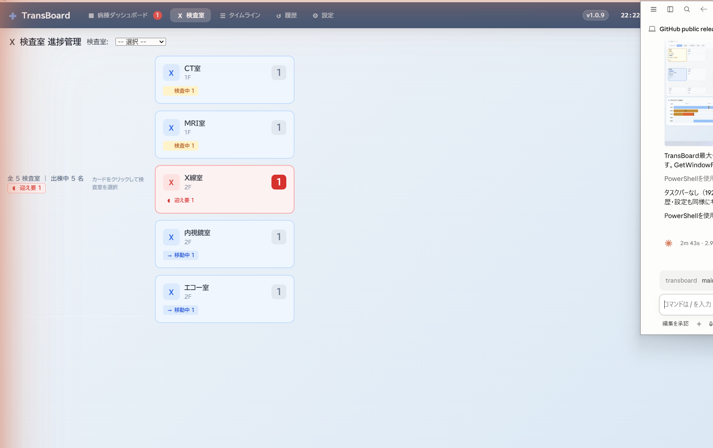
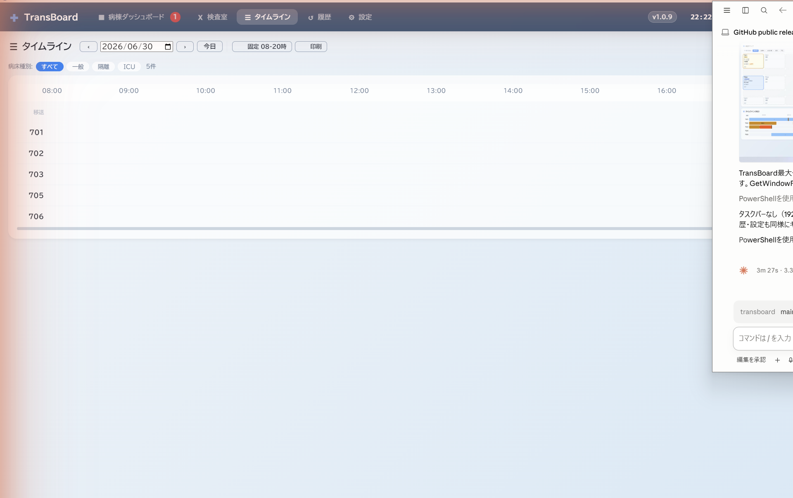
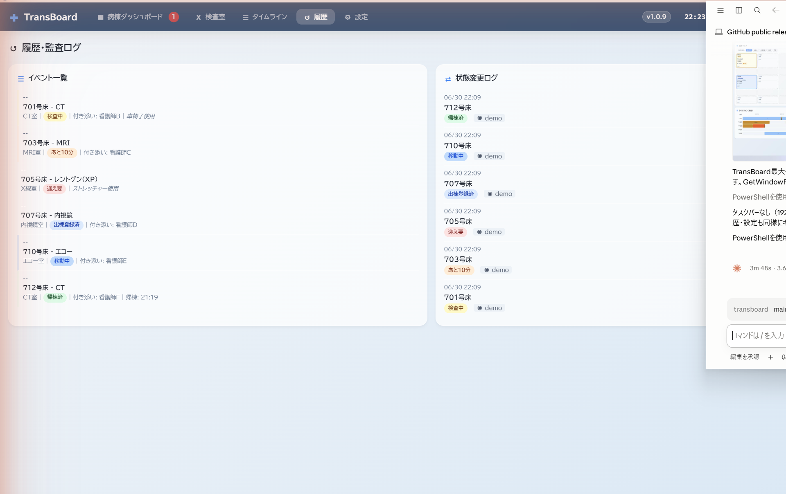
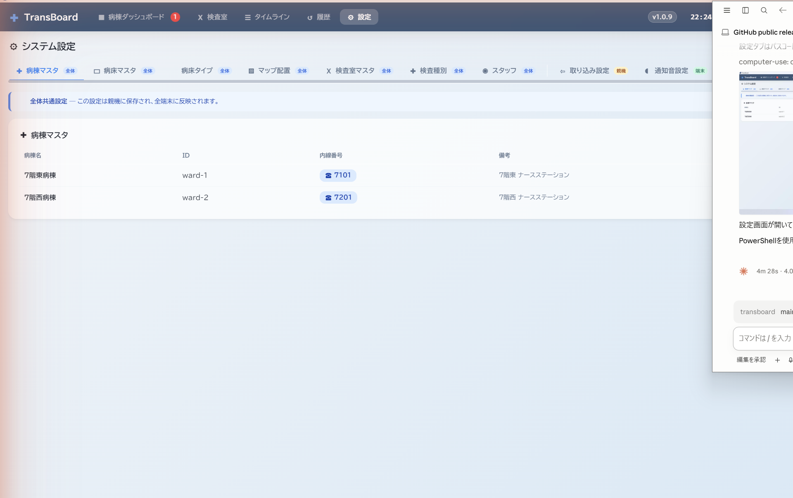

# TransBoard 操作マニュアル

> バージョン: v1.0.9  
> 対象: 看護師・検査室スタッフ・管理者

---

## 目次

1. [起動と初期設定](#1-起動と初期設定)
2. [病棟ダッシュボード](#2-病棟ダッシュボード)
3. [検査室ビュー](#3-検査室ビュー)
4. [タイムライン](#4-タイムライン)
5. [履歴・監査ログ](#5-履歴監査ログ)
6. [システム設定](#6-システム設定)
7. [移送状態の操作手順](#7-移送状態の操作手順)
8. [複数端末での運用](#8-複数端末での運用)

---

## 1. 起動と初期設定

### 初回起動時

初回起動時に**初期機能設定ウィザード**が自動的に表示されます。

| ステップ | 設定内容 |
|----------|----------|
| 1. 稼働モード | 親機（スタンドアロン/サーバー）または子機（クライアント）を選択 |
| 2. 連携設定 | 子機の場合、親機のIPアドレスを入力 |
| 3. 表示・管理 | 表示倍率・パスコードの設定 |
| 4. 確認と完了 | 設定内容を確認して完了 |

> **ヒント:** すでに設定済みの場合は「スキップ」で閉じられます。

### パスコード

設定画面はパスコードで保護されています。

- **初期値:** `0000`
- 初回起動後、必ず変更してください（設定 → 詳細設定 → パスコード変更）

---

## 2. 病棟ダッシュボード

メイン画面です。病棟内すべての患者の移送状況をリアルタイムで確認できます。

### ステータスサマリー（画面上部）

| 項目 | 説明 |
|------|------|
| 出棟中 | 現在、検査室へ移送中または検査中の患者数 |
| 付き添い中 | 看護師が付き添い対応中の患者数 |
| 迎え要 | 検査終了・帰棟の迎えが必要な患者数 |
| 15分以内 | 検査終了予定まで15分以内の患者数 |
| 遅延 | 予定時刻を超過している患者数 |

### 病床マップ

各病床カードには以下の情報が表示されます。

- **病床番号** （例: 701）
- **移送状態バッジ** （登録済 / 移動中 / 検査中 / あと10分 / 迎え要 / 帰棟済）
- **検査室・検査種別** （例: CT室 → CT）
- **残り時間・経過時間**
- **担当看護師名**

#### フィルタリング

「絞り込み」ボタンで表示する状態を絞り込めます：

- **すべて** — 全病床を表示
- **出棟中** — 移送中・検査中の病床のみ
- **お迎え要** — 迎え待ちの病床のみ
- **空床** — 空床のみ
- **不在** — 患者不在の病床のみ

### 優先対応一覧（画面右）

迎えが必要な患者を優先度順に表示します。時刻超過の場合は赤字で警告表示されます。

### タイムライン（画面下部）

当日の移送履歴を時系列バーで確認できます。「タイムラインを開く」ボタンで詳細ビューに移動します。

---

## 3. 検査室ビュー

検査室側のPC専用画面です。ナビゲーションバーの「**検査室**」タブから開きます。

### 主な操作

| ボタン | 動作 |
|--------|------|
| 到着 | 患者が検査室に到着したことを記録（状態 → 検査中） |
| あと10分 | 検査終了10分前を通知（状態 → あと10分） |
| 検査終了 | 検査完了・帰棟準備（状態 → 迎え要） |

> **検査室ビューは子機からでも操作可能です。** 検査室に子機タブレットを置いてご利用ください。

---

## 4. タイムライン

当日の全移送イベントを時系列で確認できます。ナビゲーションバーの「**タイムライン**」タブから開きます。

- 横軸が時刻、縦軸が病床番号
- バーの色で移送状態を視覚的に識別
- 過去のイベントにマウスを合わせると詳細情報を表示

---

## 5. 履歴・監査ログ

過去の移送履歴と状態変更の監査ログを確認できます。ナビゲーションバーの「**履歴**」タブから開きます。

### イベント一覧（左パネル）

患者ごとの移送イベント一覧。検査室・状態・担当者・使用備品が記録されます。

### 状態変更ログ（中央パネル）

いつ・誰が・どの患者の状態を変更したかの詳細ログ。

### 通話履歴（右パネル）

院内通話（WebRTC）の発着信履歴。

### CSVエクスポート

画面右上の「CSV出力」ボタンで履歴データをCSV形式でエクスポートできます。

---

## 6. システム設定

ナビゲーションバーの「**設定**」タブから開きます（パスコード入力が必要です）。

### 設定タブ一覧

| タブ | 説明 |
|------|------|
| 病棟マスタ | 病棟名・内線番号の登録・編集 |
| 病床マスタ | 病床番号・種別（一般/隔離/ICU）の登録 |
| 病床タイプ | 病床の分類設定 |
| マップ配置 | 病床マップの表示レイアウト設定 |
| 検査室マスタ | 検査室名・内線番号の登録 |
| 検査種別 | 検査名・標準所要時間の設定 |
| スタッフ | 担当スタッフの登録 |
| 取り込み設定 | CSV自動取込フォルダ・カラムマッピング設定 |
| 通知音設定 | 状態変化時の通知音設定 |
| アナウンス定型文 | 院内放送用テキストの登録 |
| スケジュール取り込み | 手術・検査スケジュールCSVの取込設定 |
| 共有・ネット | 親機/子機モード・IPアドレス設定 |

---

## 7. 移送状態の操作手順

### 病棟側（出棟登録）

1. 病床マップで対象の病床カードをクリック
2. 「出棟登録」ボタンをクリック
3. 検査室・検査種別・担当者・使用備品を入力
4. 「登録」をクリック → 状態が「出棟登録済」に変わります

### 移送開始

1. 病床カードをクリック → 「移動中」ボタンをクリック
2. 患者の移送を開始します

### 検査室側（到着〜終了）

1. 検査室ビューで対象患者の「到着」をクリック → 状態が「検査中」に変わります
2. 検査終了10分前に「あと10分」をクリック → 病棟側に通知
3. 検査終了後「検査終了」をクリック → 状態が「迎え要」に変わり、病棟に通知音が鳴ります

### 病棟側（迎え・帰棟）

1. 優先対応一覧または病床マップで「迎え要」患者を確認
2. 迎えに向かい、帰棟後に病床カードから「帰棟済」をクリック

---

## 8. 複数端末での運用

### 親機（メインPC）の設定

1. 設定 → 共有・ネット → **「親機として動作する」** を選択
2. 表示されたIPアドレスをメモ（例: `192.168.1.10`）
3. Windowsファイアウォールで**ポート 3005** を許可

### 子機（サブPC・タブレット）の設定

1. TransBoardをインストールして起動
2. 設定 → 共有・ネット → **「子機として動作する」** を選択
3. 親機のIPアドレス（例: `192.168.1.10`）を入力して保存

> 親機・子機は同一ネットワーク（院内LAN）内に接続されている必要があります。

---

## トラブルシューティング

| 症状 | 対処法 |
|------|--------|
| 子機が親機に接続できない | 親機のIPアドレスが正しいか確認。ファイアウォールでポート3005を許可 |
| CSV取込が動作しない | 監視フォルダのパスとカラムマッピングを確認。文字コードはUTF-8/Shift-JIS自動判定 |
| 通知音が鳴らない | 設定 → 通知音設定 で音量・有効/無効を確認 |
| 設定画面が開けない | パスコード初期値は `0000`。変更済みの場合は設定したパスコードを入力 |
| データが消えた | バックアップから復元：設定 → データ管理 → バックアップから復元 |

---

*TransBoard v1.0.9 — [GitHub](https://github.com/pocket-dev-id/transboard) | [Issues](https://github.com/pocket-dev-id/transboard/issues)*
